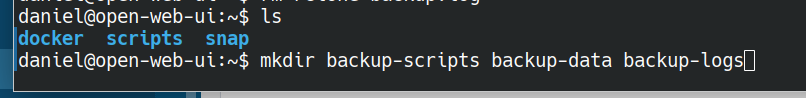

# Open-WebUI-Backups


[](https://github.com/open-webui/open-webui)
*Last updated: March 5, 2025*  
[Main Open WebUI Repository](https://github.com/open-webui/open-webui)  

This is a backup implementation for Open WebUI Docker deployments that provides a daily backup approach. The implementation can be extended with weekly and monthly backups based on your needs. The script uses B2 as the backup storage, but you can adjust the parameters for other storage solutions like S3, local NAS, or other cloud providers.

A best practice in backups is to maintain at least two copies of important data. This implementation follows a two-step approach:

1. Back up to a remote storage (B2 in this example)
2. Pull down a second copy to a local network storage

Alternatively, users may wish to back up to two different remote storage providers for additional redundancy.

The script includes basic logging functionality with logs stored in a specified directory. While the example uses `/var/log/backup_logs`, you can adjust this to your preferred location based on your system's conventions.

## Table of Contents

- [Open-WebUI-Backups](#open-webui-backups)
  - [Table of Contents](#table-of-contents)
  - [Getting Scripts \& Temp Volume Ready](#getting-scripts--temp-volume-ready)
  - [Identify Volume Mount Point](#identify-volume-mount-point)
  - [Ensure You Have Permissions Over The Docker Volume Mount](#ensure-you-have-permissions-over-the-docker-volume-mount)
  - [Set Up Rclone, Rsync, etc](#set-up-rclone-rsync-etc)
  - [See What You've Got](#see-what-youve-got)
  - [Set up remote storage](#set-up-remote-storage)
  - [Script (test)](#script-test)
  - [Add Cron Job](#add-cron-job)
  - [Environment Variables](#environment-variables)
  - [Backup Verification Checklist](#backup-verification-checklist)
  - [Additional Considerations](#additional-considerations)

## Getting Scripts & Temp Volume Ready

This implementation uses a Linux VPS. The scripts and directories can be placed in your home directory or in standard system locations like `/var/logs` for logs and `/opt` for scripts.

To get things set up, create the following directories to house the various folders needed for the backup system:

 

## Identify Volume Mount Point

The next step is identifying where the volume is actually mounted on the host. Check your Docker Compose file or Portainer settings to locate the mount path:

 

## Ensure You Have Permissions Over The Docker Volume Mount

Before doing anything else, it's essential to verify that you have the permission to read and write to the docker group, follow guides to set this up or run a command like this to inspect permissions:

`ls -l /var/lib/docker/volumes/openwebui_data/_data`

This may require adding your $USER to the Docker group, implementing or tweaking ACLs, etc. 

## Set Up Rclone, Rsync, etc

For local network backups, rsync is a good choice to backup to a NAS. This implementation uses rclone to back up to a B2 bucket, which can then be pulled down to a local NAS directly from B2. The general recommendation is to maintain at least 2 backup copies plus the source data.

## See What You've Got

Before writing the scripts, it's a good idea to examine the volume and understand the data structure OpenWebUI uses. The data structure may change over time with updates to the project. If you chose a different data mount pattern, your structure might differ.

For improved data isolation, consider setting up separate volumes for ChromaDB, SQLite, uploads, and other components. This approach can provide better isolation between component data and more granular backup control.

 

## Set up remote storage

Create a dedicated "test" bucket to verify the script functions correctly during testing. Once validated, create a production bucket for your actual backup data.

## Script (test)

Setting up backup scripts requires thorough testing to ensure they run properly. Once validated, they can be automated to run without supervision.

The ChromaDB backup method used in this script is a basic approach. If you have specific knowledge about ChromaDB, you may want to adjust the backup method according to best practices for this vector database.

One major benefit of OpenWebUI's single container architecture is that it makes starting and stopping the stack easy. To ensure the safety of the data, the container is brought down before the backup job begins and brought up after it completes. The temporary backup directory on the local server is then cleaned up after the upload to the remote. 

```bash
#!/bin/bash

# --- Configuration ---
 
OBJ_B2_ID="R4nD0MCh4R4cT3rS" 
OBJ_B2_KEY="4LpHaNum3r1cK3y"  
OBJ_B2_BUCKET="pR1Va73Buck3t" 
export OBJ_B2_ID OBJ_B2_KEY

OBJ_BACKUP_DIR="/opt/backup/storage"
OBJ_BACKUP_LOG_DIR="/var/log/backup_logs"
OBJ_TIMESTAMP=$(date +%Y%m%d_%H%M%S)
OBJ_MAIN_SQLITE_DB="/var/lib/private/data/app.db"
OBJ_VECTOR_DB_DIR="/var/lib/private/data/feature_store"
OBJ_CONTAINER_NAME="hidden-app"

# --- Helper Functions ---
log() {
  echo "$(date +'%Y-%m-%d %H:%M:%S') - $1"
  echo "$(date +'%Y-%m-%d %H:%M:%S') - $1" >> "$OBJ_BACKUP_LOG_DIR/operation_report_$OBJ_TIMESTAMP.log"
}

error_exit() {
  log "CRITICAL: $1" >&2
  echo "CRITICAL: $1" >> "$OBJ_BACKUP_LOG_DIR/operation_report_$OBJ_TIMESTAMP.log"
  exit 99
}

# --- Main Script ---
echo "Process started at $(date +'%Y-%m-%d %H:%M:%S')" >> "$OBJ_BACKUP_LOG_DIR/operation_report_$OBJ_TIMESTAMP.log"
log "Initiating safeguard procedures..."

log "Halting container..."
docker stop "$OBJ_CONTAINER_NAME" || error_exit "Failed to halt container."
echo "Container halted at $(date +'%Y-%m-%d %H:%M:%S')" >> "$OBJ_BACKUP_LOG_DIR/operation_report_$OBJ_TIMESTAMP.log"

sleep 3
sync

log "Preparing archive location..."
mkdir -p "$OBJ_BACKUP_DIR" || error_exit "Failed to prepare archive location."

log "Securing database..."
sqlite3 "$OBJ_MAIN_SQLITE_DB" ".backup '$OBJ_BACKUP_DIR/app_data_$OBJ_TIMESTAMP.dat'"  || error_exit "Failed to secure database."

log "Archiving feature store..."
tar -czvf "$OBJ_BACKUP_DIR/feature_store_$OBJ_TIMESTAMP.tar.gz" "$OBJ_VECTOR_DB_DIR" || error_exit "Failed to archive feature store."

log "Purging intermediary files..."
rm -f "$OBJ_BACKUP_DIR/app_data_$OBJ_TIMESTAMP.dat"
rm -f "$OBJ_BACKUP_DIR/feature_store_$OBJ_TIMESTAMP.tar.gz"

log "Bundling archives..."
tar -czvf "$OBJ_BACKUP_DIR/complete_archive_$OBJ_TIMESTAMP.tar.gz" -C "$OBJ_BACKUP_DIR" --exclude='.*' . || {
  log "Retrying bundle creation..."
  sleep 2

  tar -czvf "$OBJ_BACKUP_DIR/complete_archive_$OBJ_TIMESTAMP.tar.gz" -C "$OBJ_BACKUP_DIR" --exclude='.*' . || error_exit "Failed to create bundle after retry."
}

log "Verifying remote storage location..."
rclone mkdir "b2:$OBJ_B2_BUCKET" || {
  if ! rclone lsd "b2:$OBJ_B2_BUCKET" 2>&1 | grep -q "Directory not found"; then
    log "Remote storage location exists, proceeding..."
  else
    error_exit "Failed to verify remote storage location."
  fi
}

log "Resuming container..."
docker start "$OBJ_CONTAINER_NAME" || error_exit "Failed to resume container."
echo "Container resumed at $(date +'%Y-%m-%d %H:%M:%S')" >> "$OBJ_BACKUP_LOG_DIR/operation_report_$OBJ_TIMESTAMP.log"

log "Transmitting archive..."
rclone copy "$OBJ_BACKUP_DIR/complete_archive_$OBJ_TIMESTAMP.tar.gz" "b2:$OBJ_B2_BUCKET" || error_exit "Failed to transmit archive."

log "Sanitizing local storage..."
rm -f "$OBJ_BACKUP_DIR/complete_archive_$OBJ_TIMESTAMP.tar.gz"

log "Process completed!"
echo "Process finalized successfully at $(date +'%Y-%m-%d %H:%M:%S')" >> "$OBJ_BACKUP_LOG_DIR/operation_report_$OBJ_TIMESTAMP.log"

exit 0
```

## Add Cron Job

Once you've verified that your version of the script is running successfully, add it as a cron job for automatic execution. 

## Environment Variables

The model script above uses hardcoded B2 secrets and the bucket name.

Consider using a more secure approach according to your preference. 

## Backup Verification Checklist

Use this checklist to ensure your backup system is properly set up and functioning:

- [ ] Created necessary directories for backups and logs
- [ ] Identified correct Docker volume mount point for Open WebUI
- [ ] Verified permissions to access the Docker volume
- [ ] Installed and configured rclone or rsync
- [ ] Created test bucket in remote storage (B2, S3, etc.)
- [ ] Created production bucket in remote storage
- [ ] Tested backup script manually with success
- [ ] Verified logs are being created correctly
- [ ] Confirmed backup archives are being created and uploaded
- [ ] Added backup script to cron for automated execution
- [ ] Secured API keys and credentials properly

## Additional Considerations

There are many ways to implement backups for self-hosted services. Some alternatives or enhancements to consider:

- Creating more frequent snapshots for critical data
- Implementing a mixture of incremental snapshots and full backups
- Integrating more advanced backup practices for ChromaDB based on its specific requirements
- The backup approach could be simplified if the project begins supporting MySQL instead of SQLite, as there are more established backup tools for MySQL

It's vital to regularly test your backups by performing restore operations. A restore script to complement this backup implementation may be added in the future.
